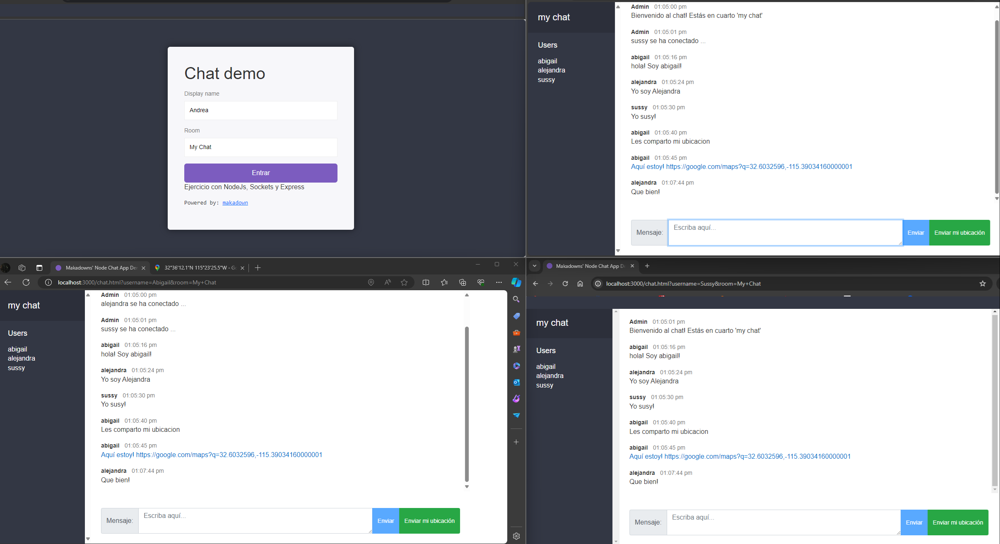

# Node-Chat-App

Proyecto demo de chat para practicar NodeJs, Express, Sockets, Geolocalizacion y Javascript.

Parte del entrenamiento en NodeJS. Instructor: Andrew Mead. 
https://www.udemy.com/course/the-complete-nodejs-developer-course-2/

## Ejecucion

> node src/index.js

o

> npm run start

## instalaciones notables

> npm install bad-words

